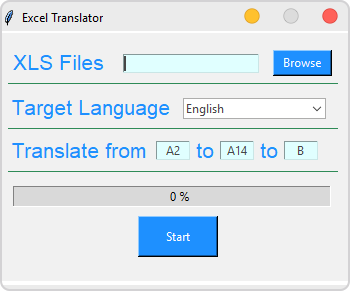
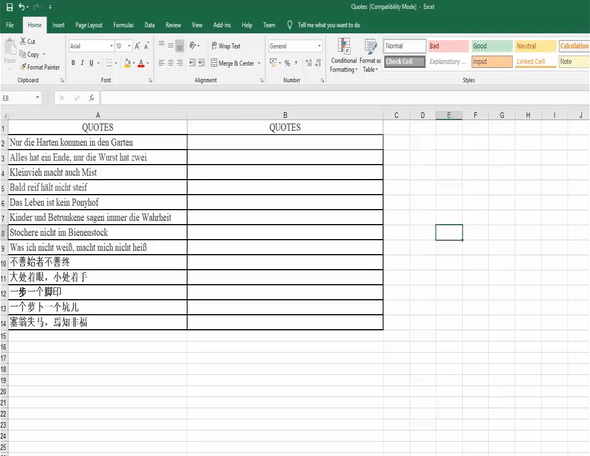
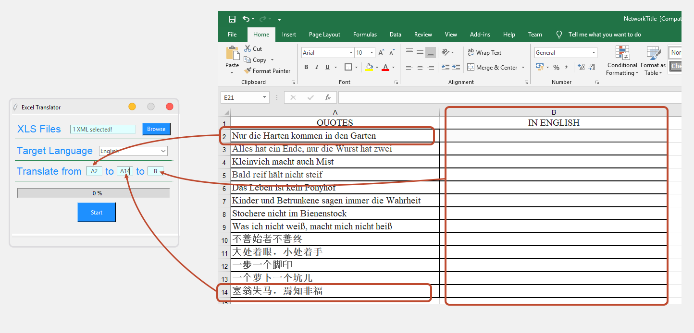

# Auto Excel Translator
Translates automatically desired rows in excel document into multiple languages. Currently only supports **xls** files.

 

## Usage

 

1- Run the program.

2- Click to browse button and select .XLS file to translate. You can select more than one file.

3- Select target language.

4- You have to specify where will the translation begin and end also where this translation will write. Example:

5- Click start button.  

## TODO
* Support all excel file.
* Advanced error log.
* Pause

## Author
* Numan Can İpekçi. [[Linkedin]](linkedin.com/in/numancan)
